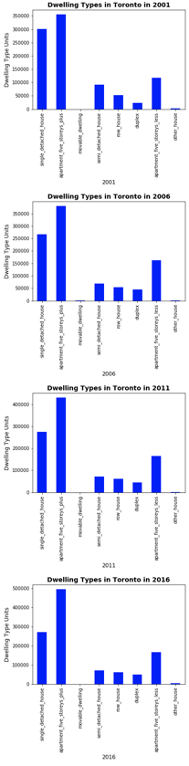
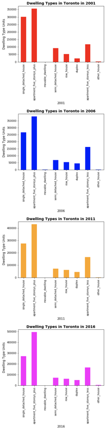
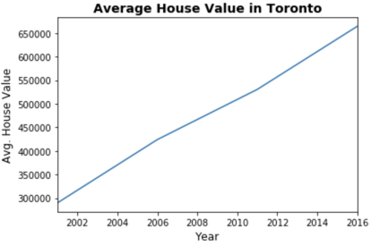

# Toronto-Real-Estate-Market

## Background

My company started a Real Estate Investment division to provide customers with a broader range of portfolio options. I wanted to build a prototype dashboard. The real estate team wants to trial this initial offering with investment opportunities for the Toronto market. If this new service is popular, then we can start to expand to other markets.

This dashboard's goal is to provide charts, maps, and interactive visualizations that help customers explore the data and determine if they want to invest in rental properties in Toronto.

Tasks include :

1. [Completing a notebook of rental analysis](#Rental-Analysis)

2. [Createing a dashboard of interactive visualizations to explore the market data](#Dashboard)

The sample data for this task was retrieved from the following websites:

* [Toronto Open Data](https://open.toronto.ca/)

* [Census Profile, 2016 Census - Toronto Metropolitan Area, Ontario and Canada](https://www12.statcan.gc.ca/census-recensement/2016/dp-pd/prof/details/page.cfm?Lang=E&Geo1=CMACA&Code1=535&Geo2=PR&Code2=01&SearchText=toronto&SearchType=Begins&SearchPR=01&B1=All&TABID=1&type=0)

---

## Files

* [toronto_neighbourhoods_census_data.csv](Starter_Code/Data/toronto_neighbourhoods_census_data.csv)

* [toronto_neighbourhoods_coordinates.csv](Starter_Code/Data/toronto_neighbourhoods_coordinates.csv)

* [Rental Analysis Starter Jupyter Notebook](Starter_Code/rental_analysis.ipynb)

* [Dashboard Starter Jupyter Notebook](Starter_Code/dashboard.ipynb)

## Rental Analysis

The first step to building the dashboard is to work out all of the calculations and visualizations in an analysis notebook. Once the code is running properly, it can be copied over to a dashboard code and used with Panel to create the final layout. 
Useing the `rental_analysis.ipynb` the following were completed :

### Dwelling Types Per Year

In this tool, I calculated the number of dwelling types per year and visualized the results as a bar chart using the Pandas plot function.

| Default Bar Charts                                  | Colored Bar Charts                                   |
------------------------------------------------------|------------------------------------------------------|
| |  |

#### Average Monthly Shelter Costs in Toronto Per Year

In this tool, I wanted to visualize the average monthly shelter costs per year to understand rental income trends over time better. Visualizing the average (mean) shelter cost for owned and rented dwellings per year and visualize it as line charts would help in making better decission on the market.

I plotted each line chart in a different colour for better visual effects.

1. Calculated the average monthly shelter costs for owned and rented dwellings for each year.

2. Visualized the monthly shelter costs per year as line charts.

    

#### Average House Value per Year

Using this tool, I wanted to determine the average house value per year. An investor may want to better understand the sales price of the rental property over time. For example, a customer will want to know if they should expect an increase or decrease in the property value over time so they can determine how long to hold the rental property. I ran visualization charts on the `average_house_value` per year as a bar chart.

1. Calculates the mean `average_house_value` for each year.

2. Visualized the `average_house_value` per year as a line chart.

  

#### Average Prices By Neighbourhood

Using this tool, custmors can compare the house value by neighbourhood.

1. I Create a new DataFrame with the mean house values by neighbourhood per year.

2. I Visualized the mean `average_house_value` per year with the neighbourhood as a dropdown selector.

(Used `hvplot` to obtain the interactive dropdown selector for the neighbourhood.)

  

#### Number of Dwelling Types per Year

In this tool, I wanted to visualize the number of dwelling types per year in each neighbourhood. I wanted to provide investors a tool to understand the evolution of dwelling types over the years.

(Used `hvplot` to create an interactive visualization of the average number of dwelling types per year with a dropdown selector for the neighbourhood.)

#### Top 10 Most Expensive Neighbourhoods

In this tool, I wanted to figure out which neighbourhoods are the most expensive. I calculated the mean house value for each neighbourhood and then sort the values to obtain the top 10 most expensive neighbourhoods on average. Plotted the results as a bar chart.

#### Neighbourhood Map

In this final tool, I can read in neighbourhood location data and build an interactive map with the average prices per neighbourhood. Used a scatter Mapbox object from Plotly express to create the visualization. (used Mapbox API key).

  

#### Cost Analysis 

Plotly express offers a broad selection of interactive plots. In tool, I used Plotly express to create a couple of plots that investors can interactively filter and explore various factors related to the house value of Toronto's neighbourhoods.

1. Created a bar chart row facet to plot the average house values for all Toronto neighbourhoods per year.

    (You can learn more about facet plots in Plotly Express in [this link](https://plotly.com/python/facet-plots/)).

   

2. Created a sunburst chart to conduct a cost analysis of the most expensive neighbourhoods in Toronto per year.

    You can learn more about sunburst charts in Plotly Express in [this link](https://plotly.com/python/sunburst-charts/).

    

### Dashboard

Now that I have worked out all of the code and analysis, I used the Panel library to build an interactive dashboard for all of the visualizations. 

Useing the `dashboard.ipynb` starter notebook for the dashboard code, I copied over the code for each visualization and placed this into separate functions (1 function per visualization). This will make it easier to build and modify the layout later. Each function will return the plot figure in a format that Panel can use to plot the visualization.

Sample Dashboard:

  

---
